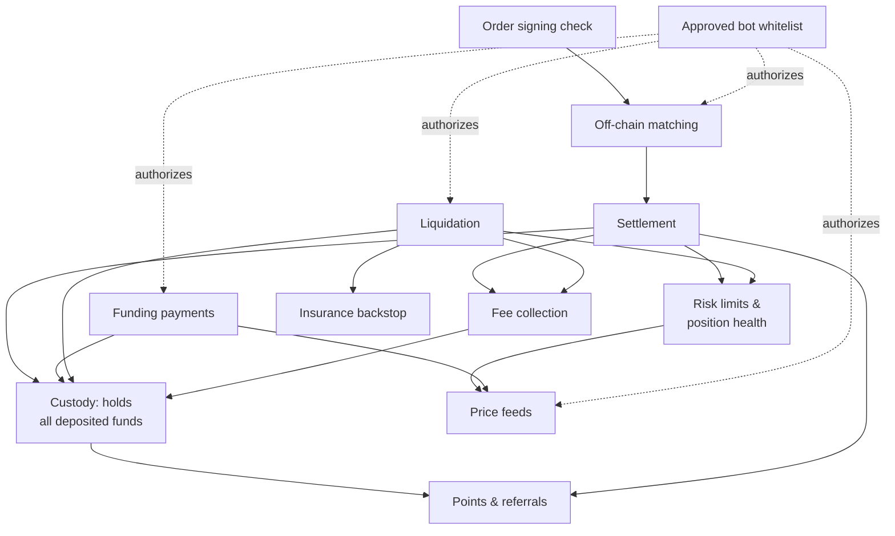

Perpetra is composed of a set of focused contracts, each responsible for exactly one job. Rather than one large contract that does everything, this design keeps each piece auditable in isolation and makes the rules that govern your funds easy to reason about. Here's what each group does, and how they connect to each other. For live deployment addresses, see [Contract Addresses](/reference/contract-addresses).

## How the pieces connect

---

## Trading Core

The trading core is the path every order travels from submission to a settled position. The Router acts as the single entry point, delegating to specialized engine contracts for each type of action.

<AccordionGroup>
  <Accordion title="Router">
    The single entry point for all trading actions. When you open, increase, or close a position, your transaction arrives here first. The Router delegates to the appropriate engine contract and ensures the caller has a valid signed order before anything else happens.
  </Accordion>
  <Accordion title="EngineOpen">
    Handles opening new positions and increasing the size of existing ones. It calls the Risk Engine to validate the trade and the Vault to move collateral before writing the new position to the registry.
  </Accordion>
  <Accordion title="EngineClose">
    Handles reducing or fully closing open positions. It calculates realized PnL, applies any funding owed, and instructs the Vault to return the appropriate collateral to the trader.
  </Accordion>
  <Accordion title="EngineConfig">
    Stores the per-market configuration that both engine contracts enforce: leverage limits, maximum position sizes, initial and maintenance margin ratios, and open interest caps. Changes here flow automatically into every trade and health check.
  </Accordion>
</AccordionGroup>

---

## Position & Risk

These contracts track every open position and decide whether trades are allowed and whether existing positions remain healthy. They are the authoritative source of truth for both trade approval and liquidation eligibility. See [Risk Engine](/architecture/risk-engine) for the full logic.

<AccordionGroup>
  <Accordion title="PositionRegistry">
    The on-chain ledger of every open position. It records size, collateral, entry price, margin mode, and current funding index for each position. All settlement, health checks, and liquidations read from and write to this contract.
  </Accordion>
  <Accordion title="RiskEngine">
    The central gatekeeper for all trading and liquidation decisions. It checks initial margin requirements, leverage bounds, position size limits, and market-wide open interest caps when a trade is attempted. It also calculates margin ratios and liquidation eligibility for existing positions.
  </Accordion>
  <Accordion title="OrderValidator">
    Verifies that a submitted order carries a valid EIP-712 signature from the trader who claims to have placed it. This check runs before a match is ever sent on-chain, and again on-chain before settlement, so no unsigned or tampered order can reach the settlement layer. See [Order Signing (EIP-712)](/architecture/order-signing-eip712).
  </Accordion>
</AccordionGroup>

---

## Pricing

Price contracts supply the reference and mark prices that everything else depends on — from trade validation and PnL calculation to liquidation triggers. Multiple sources are aggregated and cross-checked for reliability. See [Mark Price & Index Price](/trading/mark-price-and-index-price).

<AccordionGroup>
  <Accordion title="PerpetraOracle">
    The primary oracle contract that the rest of the platform queries for prices. It aggregates inputs from multiple underlying sources and exposes a single canonical price for each market, along with the metadata needed to assess its freshness.
  </Accordion>
  <Accordion title="SupraOracle">
    An off-chain price feed adapter that brings Supra's data into the oracle stack. Used as one of the underlying sources for PerpetraOracle's aggregated prices.
  </Accordion>
  <Accordion title="ChainlinkOracle">
    A Chainlink price feed adapter. Provides an additional independent data source for PerpetraOracle to cross-reference.
  </Accordion>
  <Accordion title="SaucerSwapTWAPOracle">
    A time-weighted average price feed derived from SaucerSwap on-chain liquidity. Particularly relevant for the HTS token markets where deep off-chain oracle coverage may be thinner.
  </Accordion>
  <Accordion title="MarketRegistry">
    Stores the configuration for every tradeable market: which assets are paired, which oracle sources to use, and which engine config applies. Adding a new market or changing an oracle source happens here.
  </Accordion>
</AccordionGroup>

---

## Custody & Accounts

All funds on Perpetra flow through a single custody contract. No other contract holds your tokens directly — they only instruct the Vault to move value. This design keeps the audit surface for fund safety as small as possible.

<AccordionGroup>
  <Accordion title="Vault">
    The sole contract that actually holds deposited tokens. Every deposit, withdrawal, fee payment, liquidation payout, and funding transfer is ultimately an instruction to the Vault to move funds from one account to another. Nothing leaves or enters the platform without passing through here. See [Deposits & Withdrawals](/trading/deposits-and-withdrawals).
  </Accordion>
  <Accordion title="AccountManager">
    Manages the per-user account state that sits on top of the Vault — primarily collateral balances across margin modes and cross-position netting for cross-margined accounts. It translates between raw Vault balances and the account view you see in the trading interface.
  </Accordion>
</AccordionGroup>

---

## Settlement

These contracts handle the ongoing financial obligations of open positions after they're created: funding flows between longs and shorts, fees are collected and distributed, and the insurance fund backstops liquidations that come up short.

<AccordionGroup>
  <Accordion title="FundingManager">
    Calculates and applies funding payments on a regular schedule, moving value between long and short holders to keep Perpetra's mark price aligned with the broader market index price. See [Funding Rate](/trading/funding-rate).
  </Accordion>
  <Accordion title="FeeCollector">
    Receives trading fees at settlement and liquidation fees at close-out, then routes them to their configured destinations. See [Fees](/trading/fees).
  </Accordion>
  <Accordion title="InsuranceFund">
    A reserve that covers the keeper fee on liquidations where the liquidated position's own collateral wasn't sufficient to pay it. It prevents keepers from being underpaid and ensures the liquidation system remains financially sustainable even when positions are deeply underwater. See [Liquidation Engine](/architecture/liquidation-engine).
  </Accordion>
  <Accordion title="Liquidator">
    The dedicated contract for closing out unhealthy positions. Only approved keeper bots can call it. It checks position health immediately before acting, settles PnL and funding, pays the keeper, returns any remaining collateral to the trader, and calls the InsuranceFund when needed. See [Liquidation Engine](/architecture/liquidation-engine).
  </Accordion>
</AccordionGroup>

---

## Governance & Incentives

These contracts manage who is allowed to operate keeper bots and how activity on the platform is tracked for future rewards.

<AccordionGroup>
  <Accordion title="KeeperRegistry">
    The whitelist of approved keeper bots and their permitted actions. Any bot that wants to trigger matching, liquidations, funding updates, or price pushes must be registered and active here. See [Keeper System](/architecture/keeper-system).
  </Accordion>
  <Accordion title="PointsSystem">
    Records points earned from trading volume and deposits, as well as referral relationships between users. Points are purely a scoreboard right now — nothing is distributed or claimable yet — but this contract builds the activity record that future rewards will be based on. See [Points & Referrals](/architecture/points).
  </Accordion>
</AccordionGroup>

<Note>
  All live contract addresses for Hedera testnet are listed in [Contract Addresses](/reference/contract-addresses).
</Note>
