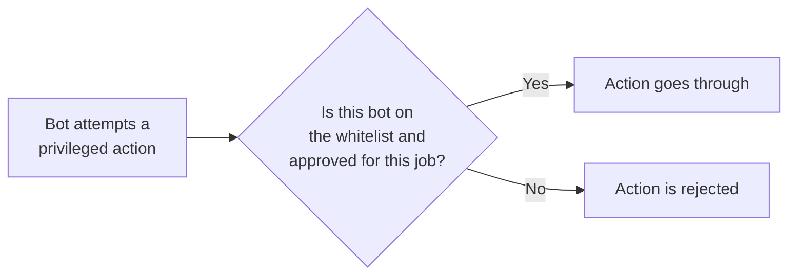

Several critical platform actions can't happen on their own — Perpetra's contracts don't self-trigger. Submitting a matched trade for settlement, closing out an unhealthy position, updating the funding rate on schedule, and pushing fresh oracle prices all require an external bot to initiate the transaction. Perpetra maintains a whitelist of exactly which bots are allowed to do each of those things. That whitelist is the keeper system.

<Note>
  Keepers never hold or control user funds. Being on the whitelist only lets a bot trigger an action the platform would already allow — it gives the bot no special power over anyone's money. Every action a keeper submits is still subject to all the same on-chain validation checks as any other transaction.
</Note>

## The four jobs a keeper can do

Each registered keeper is approved for one or more specific roles:

<CardGroup cols={2}>
  <Card title="Matching" icon="arrow-right-arrow-left">
    Submitting matched orders to the settlement contracts after the off-chain matching engine has paired them and they've passed live validation. See [Off-Chain Matching Engine](/architecture/off-chain-matching-engine).
  </Card>
  <Card title="Liquidating" icon="triangle-exclamation">
    Identifying unhealthy positions and submitting them to the Liquidator contract for close-out. Liquidation keepers earn a fee from the position's collateral for each successful liquidation. See [Liquidation Engine](/architecture/liquidation-engine).
  </Card>
  <Card title="Funding" icon="clock-rotate-left">
    Triggering the FundingManager to apply the current funding rate and transfer payments between long and short holders on schedule. See [Funding Rate](/trading/funding-rate).
  </Card>
  <Card title="Pricing" icon="chart-line">
    Pushing fresh price data to the oracle contracts so that mark prices, health checks, and PnL calculations stay current. See [Mark Price & Index Price](/trading/mark-price-and-index-price).
  </Card>
</CardGroup>

A single bot can be approved for more than one role at once.

## How the authorization check works

Every time a bot tries to trigger a privileged action, two things are checked before anything else happens:

1. **Is this bot currently active?** A bot can be registered but paused, in which case it's blocked from triggering anything.
2. **Is this bot approved for this specific job?** Approval is per-role — being approved to push prices doesn't allow a bot to trigger liquidations.

If either check fails, the action is blocked immediately.

## Pausing a bot without losing its history

If a registered keeper goes offline, behaves unexpectedly, or needs to be taken out of rotation for any reason, it can be **paused** rather than deleted. Pausing stops the bot from triggering any further actions, but its registration record — when it joined, which roles it's approved for — stays intact. It can be reactivated later without re-registering.

A bot's approved roles can also be changed independently of its active/paused status, so you can add or remove role approvals on a running bot without taking it offline.

## Monitoring bot health

Every time a keeper successfully triggers an action, the platform records that the bot was active at that moment. This record can only be written by the platform itself — a bot can't fake its own activity log. If a bot is still on the whitelist but hasn't recorded any successful actions in a while, that's an early signal that something may be wrong with that specific bot, not with the platform overall.

## What this means for you as a trader

- **Timely liquidations** — Liquidation keepers run continuously, which means unhealthy positions are closed out promptly. This protects solvent traders from counterparties whose losses are growing beyond their collateral.
- **Current funding rates** — Funding keepers keep payments applied on schedule, so the rate you see in the interface reflects what's actually being settled.
- **Fresh prices** — Pricing keepers ensure the oracle prices used for health checks and PnL calculations don't go stale.
- **Orderbook depth** — Matching keepers (including market-making bots) keep the book populated with resting liquidity, so your orders have counterparties to match against.

<Info>
  If you're interested in running a keeper for Perpetra, the KeeperRegistry contract governs registration and approval. See [Contract Map](/architecture/contract-map) for the contract overview and [Contract Addresses](/reference/contract-addresses) for live addresses.
</Info>
