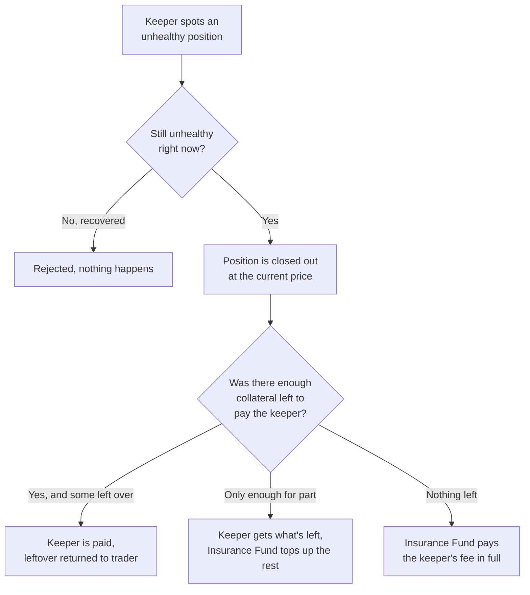

When a position's losses reduce its collateral below the maintenance margin threshold, it becomes eligible for liquidation. Perpetra closes these positions out through a dedicated Liquidator contract, kept separate from everything else so its logic is independently auditable and easy to reason about. Only approved keeper bots — see [Keeper System](/architecture/keeper-system) — are allowed to trigger a liquidation.

## When a position becomes liquidatable

A position is eligible for liquidation when its **effective collateral** falls below its **maintenance margin**:

```
effectiveCollateral < maintenanceMargin  →  position is liquidatable
```

**Effective collateral** is your deposited collateral adjusted for unrealized PnL and any accrued funding payments. A position with a large unrealized loss or a significant funding debt can become liquidatable even if the price hasn't moved dramatically against you. See [PnL & Liquidation](/trading/pnl-and-liquidation) for the full calculation.

<Warning>
  Accumulated funding payments reduce your effective collateral over time. Monitor your margin ratio regularly, especially on positions held open across multiple funding periods.
</Warning>

## Isolated vs. cross margin liquidations

The two margin modes are liquidated differently:

<Tabs>
  <Tab title="Isolated Positions">
    Isolated positions are liquidated one at a time or in a batch where each is handled independently. Only the collateral assigned to that specific position is at stake — other positions in your account are unaffected.
  </Tab>
  <Tab title="Cross-Margined Positions">
    Cross-margined positions are liquidated as a whole account. If any position in your cross book for a given collateral token needs liquidating, the **entire cross book for that token** is closed out together.

    This is intentional — cross positions share the same collateral pool, so they must be resolved as a set to produce an accurate outcome. A keeper cannot cherry-pick which cross positions to liquidate.
  </Tab>
</Tabs>

## How a single liquidation works



Before the Liquidator settles anything, it re-checks the position's health using the **current** oracle price. A position that has recovered since the keeper identified it is rejected — no unnecessary liquidations. Only a position that is still unhealthy at execution time is closed.

Once confirmed, the settlement works as follows:

1. Any funding owed by the position is applied.
2. Unrealized PnL is realized at the current mark price.
3. The keeper's fee is taken from the remaining collateral.
4. Whatever collateral is left returns to the trader.

## How the keeper fee is paid

The keeper always receives their full fee — one way or another. The source depends on how much collateral is left in the position after PnL and funding are settled:

<AccordionGroup>
  <Accordion title="effectiveCollateral ≥ keeperFee (normal case)">
    The keeper is paid `keeperFee` from the position's collateral. The remainder — `effectiveCollateral − keeperFee` — is returned to the trader.

    This is the standard outcome for positions that are liquidated promptly before losses become severe.
  </Accordion>
  <Accordion title="0 < effectiveCollateral < keeperFee (partially undercollateralized)">
    The keeper receives whatever effective collateral remains. The Insurance Fund covers the shortfall — `keeperFee − effectiveCollateral` — so the keeper still receives their full fee.

    The trader receives nothing back from this position.
  </Accordion>
  <Accordion title="effectiveCollateral ≤ 0 (fully undercollateralized)">
    There is no collateral remaining in the position. The Insurance Fund pays the keeper's full fee. Nothing is returned to the trader.

    This outcome occurs when a position's losses exceeded its entire collateral before a keeper was able to close it.
  </Accordion>
</AccordionGroup>

## The Insurance Fund

The Insurance Fund is a reserve that backstops liquidations where the position's own collateral isn't enough to pay the keeper. It ensures that keepers are always compensated for their work, which keeps the liquidation system financially sustainable and ensures that unhealthy positions continue to be closed out even in adverse market conditions.

<Info>
  The Insurance Fund is funded through a portion of trading fees collected by the FeeCollector contract. See [Fees](/trading/fees) for how fees are split.
</Info>

## Liquidating in bulk

A keeper can submit a batch of positions for liquidation in a single transaction. Each position in the batch is handled independently — if one turns out to be healthy or otherwise invalid, it's skipped and the rest of the batch still processes. One bad entry doesn't block the others.

## Cross-book liquidation requirements

When a keeper liquidates a cross-margined account, it must include **every** open position in the account's cross book for that collateral token. Submitting a partial subset is not allowed. This prevents a keeper from strategically excluding profitable positions that would otherwise offset the unhealthy ones and change the final outcome.

The combined book is settled together: PnL, funding, and losses across every position are netted into a single total, and the keeper fee logic runs once against that combined result.

## Checking eligibility before acting

Before submitting a real liquidation transaction, a keeper can check whether a position currently qualifies — cheaply, without spending gas on a full transaction. This lets keeper bots efficiently scan many positions without wasting resources on ones that are actually healthy.
