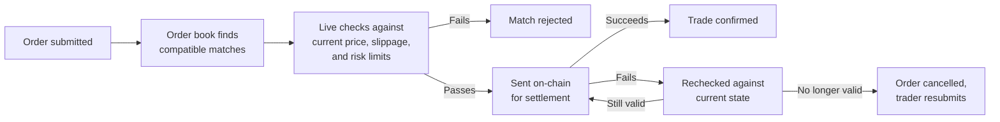

Every trade on Perpetra starts with a match, and matching happens entirely off-chain, in memory, before any transaction is sent to Hedera. This is what lets you place and cancel limit orders without paying gas, and why executions feel fast even though settlement is fully on-chain. The chain only gets involved once a valid match is ready to finalize.

## One order book per market

Each market maintains its own live order book. Orders are sorted by price first and arrival time second: the best-priced order is always at the front, and among orders at the same price, the one that arrived earliest gets matched first. This is the standard price-time priority you'd recognize from any order-driven exchange.

When a new order arrives, the matching engine checks the opposite side of the book — buyers against sellers, sellers against buyers — starting from the best available price and working outward until either:
- The incoming order is fully matched, or
- No remaining order on the opposite side is willing to trade at a compatible price.

<Note>
  Self-trades are blocked automatically. Your own resting orders are never matched against your own incoming orders, regardless of price.
</Note>

## How limit orders and market orders behave differently

Once the matching pass finishes, the two order types diverge:

<Tabs>
  <Tab title="Limit Orders">
    A limit order that doesn't fully match rests on the book at your specified price, waiting for a future order to complete it. It stays there until one of three things happens:

    - A compatible order arrives and it gets matched
    - You cancel it directly
    - Its expiry time passes and it's automatically swept off the book

    Partial fills are possible: if a match is found for part of your order size but not all of it, the matched portion proceeds to settlement and the remainder keeps resting.
  </Tab>
  <Tab title="Market Orders">
    A market order executes against whatever is available on the book right now. Any portion that doesn't find a match immediately is **dropped** — it never rests on the book and never waits for a future order. What you get is what's available at this moment.

    This means a market order in a thin book can execute for less than your intended size. If execution certainty matters more than exact size, a limit order gives you more control.
  </Tab>
</Tabs>

## Why matching and live validation are kept separate

The order book only knows about resting orders and the prices attached to them. It has no concept of the current oracle price, whether a trader's slippage tolerance has been breached, what the market's live open interest is, or whether any risk limit would be hit. All of that lives in a separate live validation step that runs after the book finds a match and before anything goes on-chain.

This separation is deliberate. Keeping the book simple and fast means it can process high throughput without becoming a bottleneck. The live checks run only when a match is actually found — not on every order as it rests — so they can afford to be thorough. See [Risk Engine](/architecture/risk-engine) and [Slippage & Execution](/trading/slippage-and-execution) for what those checks cover.

## What price a trade actually settles at

A limit price is a **boundary**, not a guaranteed execution price. The order book uses your limit price to decide whether two orders are compatible — a buy order at $100 and a sell order at $99 are compatible; a buy at $98 and a sell at $99 are not. But the actual settlement price of every trade is the live oracle mark price at the moment of settlement, not either trader's limit price.

<Tip>
  This means you can get a better price than your limit if the oracle is favorable at settlement time. Your limit price is the worst price you'll accept, not the price you're locked into.
</Tip>

## When settlement fails

If an on-chain settlement attempt fails, nothing has actually changed on-chain — the failure is clean. The trade is rechecked against current live conditions and retried if it still looks valid. If conditions have changed enough that the trade is no longer valid, it's marked as failed rather than left in an ambiguous half-done state. Any remaining portion of either order is pulled off the book, and you'll need to submit a fresh order rather than relying on the old one.

## What this means for you as a trader

- **No gas on order placement or cancellation** — you only pay settlement costs when a trade actually finalizes on-chain.
- **Real limit orders** — your order rests at your exact price and executes when the market reaches it, not at a worse price due to slippage from the order-matching process itself.
- **Fast matching** — because matching runs in memory, not on-chain, compatible orders are paired in milliseconds.
- **Transparent queue** — price-time priority means the rules for who gets matched first are simple and consistent.
