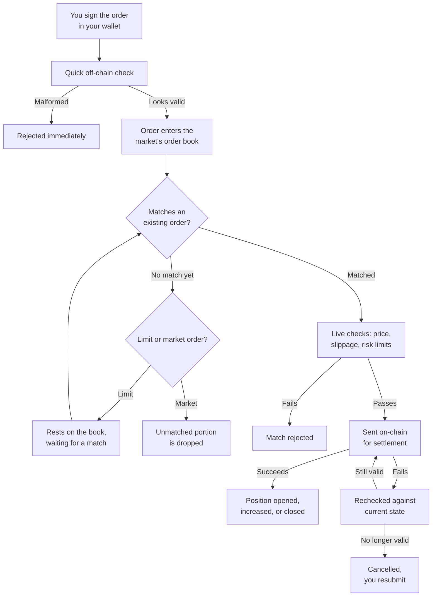

Placing an order on Perpetra isn't a single step — it's a sequence of distinct stages, each with its own purpose. Understanding the full path helps you know what's happening when an order executes immediately, rests on the book waiting for a fill, or comes back rejected. Here's every stage, in order.

<Steps>

  <Step title="Sign the order in your wallet">
    Every order starts as a set of exact parameters: the market, direction (long or short), size, collateral, price limit, slippage tolerance, and expiry. Your wallet combines these into a single fixed value and signs it. That signature is what proves you authorized this exact order — not a slightly different one, and not on a different chain. Nothing can be submitted to Perpetra on your behalf without a valid signature from your wallet.

    See [Order Signing (EIP-712)](/architecture/order-signing-eip712) for the full details of how this signature works and how it's verified.

    **If something goes wrong here:** Your wallet rejects the signing request. Nothing is submitted.
  </Step>

  <Step title="Fast off-chain sanity check">
    When your signed order arrives at Perpetra, it passes through a quick filter before going anywhere near the matching engine. This check catches obviously malformed or forged submissions — things like a missing or corrupted signature, an unrecognized market, or fields that don't make sense together.

    This is a fast filter, not a security guarantee. The real authority always sits on-chain.

    **If something goes wrong here:** Your order is rejected immediately and nothing further happens. You'll need to correct whatever caused the rejection and resubmit.
  </Step>

  <Step title="Enter the order book">
    Once it clears the sanity check, your order enters its market's order book. It's immediately checked against the opposite side — buyers are matched against sellers, sellers against buyers — starting from the best available price and working outward.

    - If a compatible order is already resting on the opposite side, your order moves straight to the live validation stage.
    - If no match is available yet, what happens next depends on your order type.

    See [Off-Chain Matching Engine](/architecture/off-chain-matching-engine) for how the book is organized and how matching works.
  </Step>

  <Step title="Wait for a match (limit orders only)">
    A **limit order** that doesn't match immediately rests on the book at your specified price, waiting for a future order to complete it — exactly like a traditional exchange order book. It remains there until it matches, you cancel it, or it reaches its expiry time.

    A **market order** behaves differently: any portion that doesn't find an immediate match is simply dropped. A market order never waits on the book.

    <Note>
      Your own resting orders are never matched against your own incoming orders. Self-trades are skipped automatically.
    </Note>
  </Step>

  <Step title="Live validation">
    A match found in the order book isn't automatically final. Before anything is sent on-chain, a second independent check runs against current live conditions:

    - Has the mark price moved enough to breach your slippage tolerance?
    - Would this trade violate a risk limit (leverage cap, open interest cap, position size cap)?
    - Is the market currently active?

    This check is deliberately kept separate from the order book itself. The book only knows about resting orders and prices — it doesn't know about live oracle prices, margin requirements, or market-wide exposure. See [Off-Chain Matching Engine](/architecture/off-chain-matching-engine) for why these concerns are separated, and [Slippage & Execution](/trading/slippage-and-execution) for what your price and tolerance settings actually control.

    **If something goes wrong here:** The match is rejected. Your limit order returns to resting on the book (if it hasn't expired), and a market order's unmatched portion is dropped.
  </Step>

  <Step title="On-chain settlement">
    Once a match clears live validation, it's submitted on-chain for settlement. This is where your position is actually created, increased, decreased, or closed — permanently and verifiably.

    The on-chain contract independently re-verifies your signature and the trade parameters before accepting the settlement. If the transaction succeeds, your position is updated immediately.

    **If the transaction fails:** Nothing has changed on-chain, so the trade is rechecked against whatever is true right now. If conditions have changed since the match was found (for example, the price moved or a risk limit was hit), it's checked to see whether it's still valid. If it is, settlement is retried. If it isn't, the order is cancelled.
  </Step>

  <Step title="Position update">
    A successful settlement produces one of these outcomes depending on your order:

    - **Opening a new position** — a new position record is written with your size, collateral, entry price, and margin mode.
    - **Increasing an existing position** — your existing position's size and collateral are updated.
    - **Reducing or closing a position** — realized PnL and any funding owed are settled, and your remaining collateral is returned to your account.

    From this point, the position is live and subject to ongoing funding payments and health monitoring. See [PnL & Liquidation](/trading/pnl-and-liquidation) and [Funding Rate](/trading/funding-rate).
  </Step>

</Steps>

## Cancelling an order or letting it expire

You can cancel any resting limit order at any time before it's matched. Every order also carries an expiry timestamp you set when you sign it. If your order is still on the book when that time passes, it's automatically swept off — you don't need to cancel it manually.

<Tip>
  Set a sensible expiry when placing limit orders. An order that's been resting for a long time may have been placed under market conditions very different from right now, and you may not want it to execute unexpectedly if the price eventually swings back to your limit.
</Tip>

## What "cancelled, you resubmit" means

If an order is cancelled at the settlement stage — because it failed on-chain and conditions changed enough that a retry won't work — Perpetra marks it as failed rather than leaving it in an ambiguous state. You'll need to submit a completely fresh order rather than assuming the old one is still active. This is intentional: it ensures you're always placing orders against current market conditions, not conditions from minutes ago.
