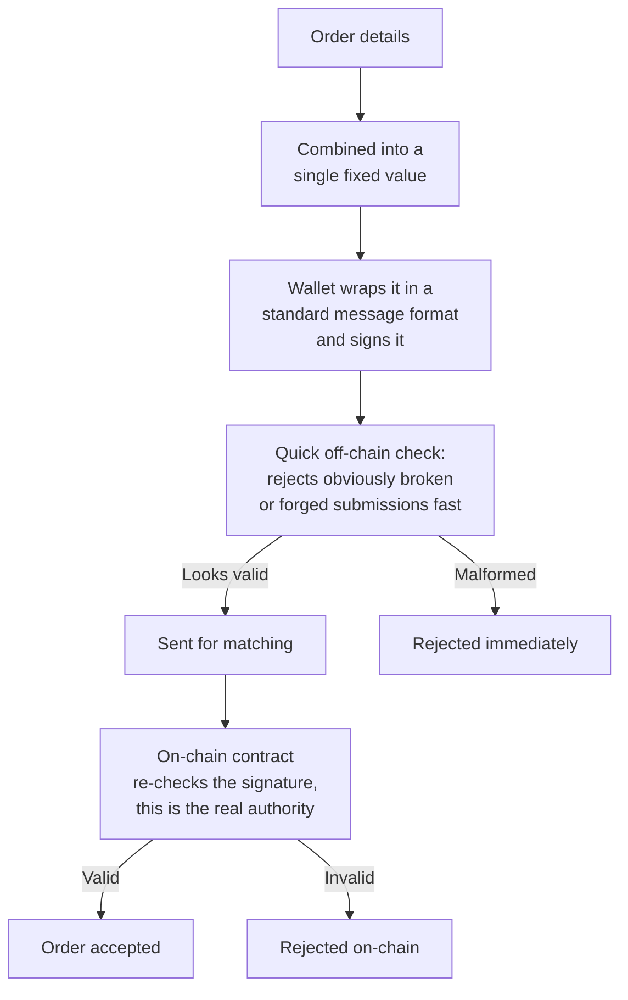

Before an order ever reaches Perpetra's matching engine, your wallet signs it. That signature is the proof that you — and only you — authorized this exact trade. No keeper bot, no matching engine, and not Perpetra itself can submit an order on your behalf without a valid signature from your wallet attached to it.

## What EIP-712 is and why Perpetra uses it

EIP-712 is a standard for signing structured, typed data with an Ethereum-compatible wallet. Rather than signing a raw blob of bytes (which gives you no way to see what you're actually approving), EIP-712 breaks the data into named fields with explicit types, so your wallet can show you exactly what you're signing in a readable format.

Perpetra uses EIP-712 for three reasons:

- **Gasless order placement** — You sign an order locally in your wallet without broadcasting a transaction. No gas is spent until a match is found and settlement actually happens.
- **Non-custodial** — Your signature authorizes one specific trade. Perpetra never has custody of your funds or your private key. You can cancel a signed order before it's executed.
- **Verifiable on-chain** — The same signature that's checked off-chain when your order arrives is independently re-verified by the settlement contract before any trade is finalized. A signature that wouldn't hold up on-chain is rejected no matter what happened earlier.

## What you're actually signing

When you place an order, your wallet asks you to sign a structured object that captures every meaningful detail of the trade:

```typescript
// The typed data structure your wallet signs
{
  market: address,         // Which market (e.g. HBAR-USDC, BTC-USDC)
  side: uint8,             // Long (0) or Short (1)
  size: uint256,           // Position size in base asset units
  collateral: uint256,     // Collateral posted (USDC)
  price: uint256,          // Your limit price (0 for market orders)
  slippageTolerance: uint256, // Max price movement you'll accept
  leverage: uint256,       // Requested leverage
  expiry: uint256,         // Unix timestamp — order dies after this
  nonce: uint256,          // Unique per-order number to prevent replay
  orderType: uint8         // Limit (0) or Market (1)
}
```

Changing even a single field — adjusting the size by one unit, for example — produces an entirely different signed value. A signature made for one version of an order is never accepted for a modified version.

## How signing works on Hedera



Hedera wallets don't sign the fixed order value directly — they wrap it in a standard message format first. Both the quick off-chain check and the final on-chain verification account for that wrapping, so what gets verified always matches what your wallet actually signed.

There's also a Hedera-specific detail worth knowing: Hedera's signature format doesn't include the extra piece of information normally used to immediately determine which of two possible signer addresses produced a given signature. Rather than have the contract guess — which could occasionally accept the wrong signer — the wallet resolves that ambiguity itself before the order is ever submitted, by testing which of the two possible addresses actually matches your account.

## The off-chain check is just a fast filter

When your signed order first arrives, a quick check catches obviously broken or forged submissions before they waste any processing. This runs fast and doesn't cost gas. It is never the final word, however — only the on-chain contract's own signature verification is authoritative. If a signature wouldn't survive on-chain scrutiny, it doesn't matter whether it passed the earlier filter.

## Preventing replay attacks and cancelling orders

Every order includes a **nonce** — a unique number tied to your account that can only be used once. Once an order with a given nonce has settled, that nonce is consumed. Nobody can take your old signed order and replay it to execute the same trade again.

You have three ways to invalidate pending signed orders:

<CardGroup cols={1}>
  <Card title="Cancel a specific order" icon="xmark">
    Cancel one particular order directly by its identifier. Only that order is affected.
  </Card>
  <Card title="Cancel a specific nonce" icon="hashtag">
    Invalidate one pending nonce before it's ever used — useful if you want to ensure a specific signed order can never execute even if you've lost track of it.
  </Card>
  <Card title="Cancel everything below a threshold" icon="ban">
    Invalidate every pending order below a certain nonce value all at once. This is an emergency "cancel all" option that works even if you don't have a list of your individual pending orders.
  </Card>
</CardGroup>

<Warning>
  Once you sign an order, it can be submitted by the matching engine at any point before it expires. If you change your mind about a trade, cancel it explicitly — don't rely on it expiring if it hasn't reached its expiry time yet.
</Warning>
