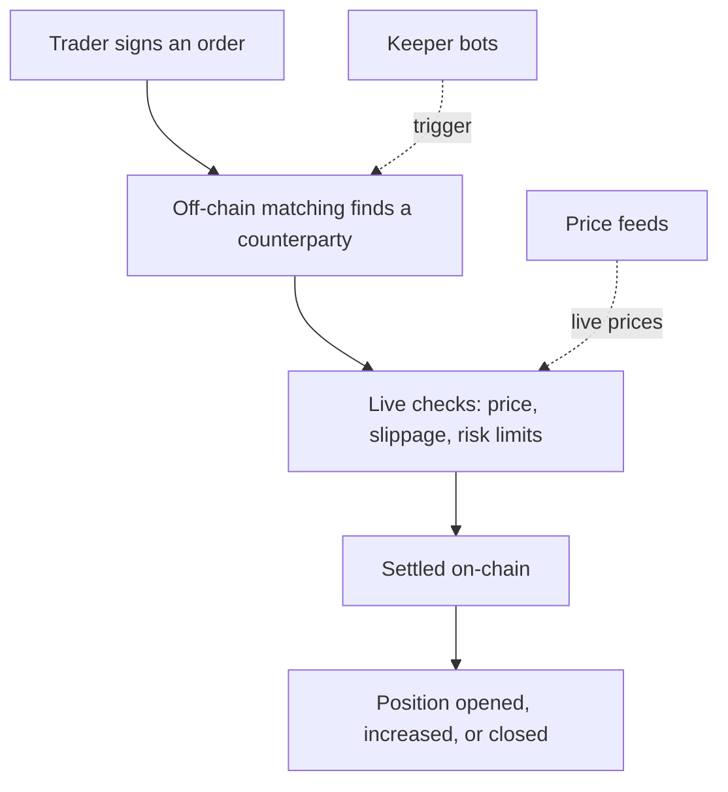

Perpetra is a perpetuals exchange built on a single core idea: matching is fast and cheap because it happens off-chain, but settlement is secure and verifiable because it always happens on-chain. Every part of the architecture flows from that split. Understanding it gives you a clear mental model of exactly what happens when you place a trade, and what keeps running in the background after your position is open.

## The two halves of a trade

When you place an order, it travels through two distinct phases before it becomes a position.

**Off-chain** — Your signed order enters the matching engine, gets paired with a counterparty at the best available price, and passes a live check against current prices, slippage tolerances, and risk limits. None of this costs gas.

**On-chain** — Only after a match has cleared every check does it go on-chain for settlement, where your position is opened, increased, or closed in a way that's cryptographically final and publicly verifiable.

## What keeps running after a trade settles

A position doesn't sit still once it's open. Several processes run continuously in the background:

- **Funding payments** flow between longs and shorts on a regular schedule to keep Perpetra's mark price aligned with the broader market. See [Funding Rate](/trading/funding-rate).
- **Position health** is monitored continuously. Any position that falls below its maintenance margin threshold becomes eligible for liquidation. See [Liquidation Engine](/architecture/liquidation-engine).
- **Fee distribution** routes trading and liquidation fees to their destinations after every relevant event. See [Fees](/trading/fees).

None of these run autonomously — they are triggered by a set of approved keeper bots, and they all depend on a continuous feed of live prices. See [Keeper System](/architecture/keeper-system) and [Mark Price & Index Price](/trading/mark-price-and-index-price).

## Funds live in one place

Every deposit, withdrawal, fee, funding payment, and liquidation payout flows through a single custody contract. No other contract holds your funds directly — they only instruct the vault to move value. See [Deposits & Withdrawals](/trading/deposits-and-withdrawals).

## Every trade is authorized by you alone

Nothing moves without your cryptographic signature. You sign the exact details of your order in your wallet before it's ever submitted, and that signature is independently verified on-chain before any trade is allowed to settle. No keeper, no matching engine, and not Perpetra itself can authorize a trade on your behalf. See [Order Signing (EIP-712)](/architecture/order-signing-eip712) and [Order Lifecycle](/architecture/order-lifecycle).

## Go deeper

<CardGroup cols={2}>
  <Card title="Contract Map" icon="map" href="/architecture/contract-map">
    See what each individual contract is responsible for and how they connect.
  </Card>
  <Card title="Order Lifecycle" icon="arrow-right-arrow-left" href="/architecture/order-lifecycle">
    Walk through the full path an order takes from signature to settled position.
  </Card>
  <Card title="Order Signing (EIP-712)" icon="pen-nib" href="/architecture/order-signing-eip712">
    Understand how your wallet proves an order came from you.
  </Card>
  <Card title="Off-Chain Matching Engine" icon="bolt" href="/architecture/off-chain-matching-engine">
    Learn how orders are paired before they ever touch the chain.
  </Card>
  <Card title="Risk Engine" icon="shield-halved" href="/architecture/risk-engine">
    See what checks every trade must pass before it can settle.
  </Card>
  <Card title="Keeper System" icon="robot" href="/architecture/keeper-system">
    Understand the approved bots that keep the platform running.
  </Card>
</CardGroup>
