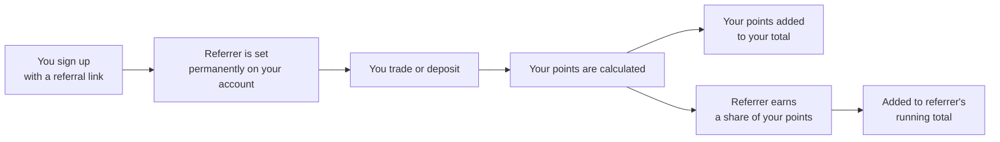

Perpetra keeps a running tally of activity for every user: points earned through trading, depositing, and referring others to the platform. Points are not a token — nothing is minted or distributed right now. This is a live record of your activity on Perpetra that will form the basis of however rewards are eventually distributed.

## How points are earned

Points accrue from two types of activity: trading and depositing. Both are tracked in terms of their USD value, multiplied by a configured rate and divided by `1e6` (the precision factor used by the PointsSystem contract):

```
tradePointsEarned   = volumeUSD * tradePointsPerUSD / 1e6
depositPointsEarned = amountUSD * depositPointsPerUSD / 1e6
```

Both rates are configurable and may be adjusted as the program evolves. The rates that apply to your activity are the rates in effect at the time that activity occurs.

**Trading points** are earned on both sides of a trade — opening a position and later closing it both count independently. You earn points each time a trade settles, not just when you first open a position.

**Deposit points** are earned when you deposit collateral. The rate for deposits is separate from the trading rate.

## The referral system



### How referrals work

- **One referrer, set once and permanent.** When you register a referral relationship, it's locked in. It cannot be changed afterward.
- **No self-referrals.** You cannot set yourself as your own referrer.
- **No referral loops.** Perpetra blocks circular referral chains — if A referred B, then B cannot refer A.
- **Ongoing share, not a one-time bonus.** Once you're referred, your referrer earns a share of the points you generate from every trade and deposit going forward. This is not a one-time signup reward — it's a continuous share of your future activity for as long as you're active on the platform.

### What your referrer earns

Your referrer earns a percentage of the points you earn, calculated as:

```
referrerPointsEarned = baseEarned * referralBps / 10_000
```

where `baseEarned` is the points you just earned from a trade or deposit, and `referralBps` is the platform-configured referral share rate (out of 10,000). The share rate may be adjusted over time. Your own points total is not reduced by the referrer's share — both of you earn from your activity independently.

<Info>
  The referrer's share is calculated on the same trade and deposit events that earn you points. Both amounts are written to the PointsSystem contract in the same transaction that records your activity.
</Info>

## What points are used for right now

Right now, points are a **scoreboard only**. Your total point balance and referral activity are visible and trackable, but nothing is distributed, claimable, or exchangeable yet. The PointsSystem contract exists to build an accurate and tamper-resistant record of activity ahead of any future rewards program.

<Note>
  Points balances are on-chain and verifiable. No activity is retroactively adjusted — what's recorded at the time of your trade or deposit is permanent.
</Note>

## Summary

<CardGroup cols={2}>
  <Card title="Trading Points" icon="chart-bar">
    Earned on both the open and close of every trade. Calculated as `volumeUSD * tradePointsPerUSD / 1e6`.
  </Card>
  <Card title="Deposit Points" icon="arrow-down-to-bracket">
    Earned when you deposit collateral. Calculated as `amountUSD * depositPointsPerUSD / 1e6`.
  </Card>
  <Card title="Referral Share" icon="users">
    Your referrer earns an ongoing share of every point you earn from trading and depositing — for as long as you're active.
  </Card>
  <Card title="Scoreboard Only" icon="trophy">
    Nothing is claimable yet. Points exist to build a verifiable activity record ahead of future rewards.
  </Card>
</CardGroup>
