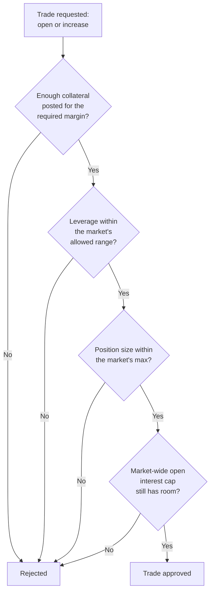

Every trade on Perpetra — whether you're opening a new position, adding to an existing one, or being evaluated for liquidation — passes through the same central set of rules. The Risk Engine is the single place that decides whether a trade is currently allowed and whether an open position is still healthy. Centralizing these rules means the same logic applies regardless of what part of the platform is asking.

## What gets checked before a trade goes through



These checks run in sequence and are independent — passing one doesn't excuse you from the others. A trade must clear all four:

<AccordionGroup>
  <Accordion title="Initial margin requirement">
    You must post enough collateral relative to the position size you're opening. The required amount is calculated as:

    ```
    initialMarginRequired = sizeUsd * initialMarginBps / 10_000
    collateralAmount >= initialMarginRequired
    ```

    `initialMarginBps` is the market's configured minimum margin fraction (out of 10,000). If your collateral falls short of this threshold, the trade is rejected.

    **What this means for you:** Make sure you have sufficient USDC in your account for the leverage you're requesting. The interface shows your required margin before you confirm.
  </Accordion>
  <Accordion title="Leverage bounds">
    Every market has both a minimum and a maximum allowed leverage. Your effective leverage is `sizeUsd / collateralAmount` — both a minimum and a maximum are enforced:

    ```
    minLeverage <= sizeUsd / collateralAmount <= maxLeverage
    ```

    Perpetra supports up to 50× leverage, but the limit for a specific market may be lower. Too low (below the minimum) or too high (above the maximum) both result in rejection.

    **What this means for you:** If your order is rejected for leverage, adjust your position size or collateral to bring your effective leverage within the allowed range for that market.
  </Accordion>
  <Accordion title="Position size limit">
    Each market has a maximum single-position size. Trades that would result in a position exceeding this cap are rejected. This limit applies per position, not per account.

    **What this means for you:** If you want more exposure than a single position allows, you may need to use multiple markets or accept a smaller position size.
  </Accordion>
  <Accordion title="Open interest cap (per side)">
    Each market tracks total long open interest and total short open interest separately. Both sides have their own configured cap. If the relevant side is already at its cap, new trades in that direction are rejected until existing positions close down and make room.

    Long and short caps are independent — one side filling up doesn't block the other.

    **What this means for you:** During periods of heavy one-sided demand, you may encounter an OI cap rejection. Wait for existing positions on that side to close, or try a different market.
  </Accordion>
</AccordionGroup>

## Ongoing position health checks

Once a position is open, the Risk Engine continuously evaluates whether it's still healthy or has become eligible for liquidation. This check compares your position's **effective collateral** against its **maintenance margin** requirement.

- **Maintenance margin** is the minimum collateral needed to keep a position open — lower than the initial margin, but if your collateral drops below it, the position becomes liquidatable.
- **Margin ratio** is your effective collateral divided by the maintenance margin threshold. A ratio below 1 (or 100%) triggers liquidation eligibility.

The full calculation — how PnL, funding, and unrealized losses feed into effective collateral — is covered in [PnL & Liquidation](/trading/pnl-and-liquidation).

<Warning>
  You don't need to breach your liquidation price to get liquidated. Accumulated funding payments reduce your effective collateral over time, which can bring your margin ratio below the threshold even if the price hasn't moved against you significantly.
</Warning>

## Isolated vs. cross margin

How the health check is applied depends on your position's margin mode:

<Tabs>
  <Tab title="Isolated Margin">
    Each position is evaluated on its own. Only the collateral you explicitly assigned to that position is counted against its maintenance requirement. One position being unhealthy has no effect on your other positions.

    **What this means for you:** Your maximum loss on an isolated position is the collateral you posted for it. You can't accidentally lose collateral from other positions.
  </Tab>
  <Tab title="Cross Margin">
    All cross-margined positions for a given collateral token are evaluated as a single unit. Your total account equity across every cross position is measured against the combined maintenance requirement of all of them together. A profitable position can offset an unhealthy one, potentially saving it from liquidation.

    **What this means for you:** Cross margin makes more efficient use of your capital, but a large losing position can pull the whole account toward liquidation. Monitor your total account health, not just individual positions.
  </Tab>
</Tabs>

See [Margin Modes](/trading/margin-modes) for a full comparison of isolated and cross margin mechanics.

## Why these rules are centralized

A single Risk Engine means the same rules apply regardless of what triggered the check — whether it's you opening a trade, a keeper bot checking whether your position is liquidatable, or the matching engine validating a fill. There's no risk of one part of the platform applying slightly looser rules than another, and an upgrade to the risk rules automatically applies to every check everywhere.
